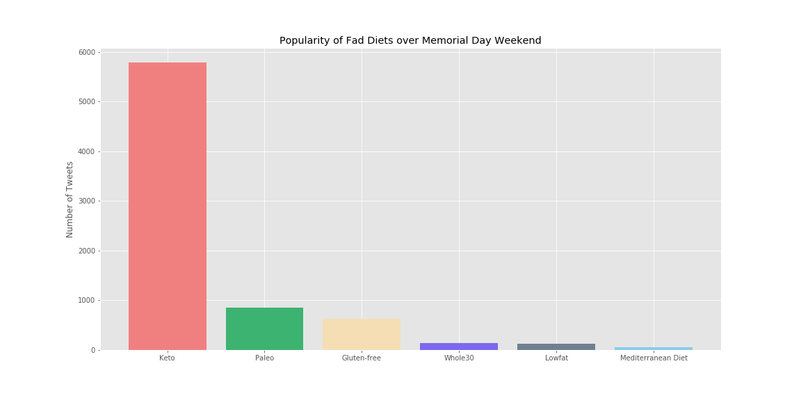

# Analyzing the Popularity and Attitudes of “Fad” Diets

## Project Description
Analyzing tweets mentioning “fad” diets over Memorial Day weekend by assessing their popularity and analyzing sentiment. The diets studied were: Keto, paleo, gluten-free, Whole30, low-fat, and Mediterranean.

## Motivation
My background is in nutrition and nutrition research. When I bring this up one of the first questions I always get is, “What do you think about <insert fad diet>. One limitation of traditional nutrition research is that it requires a big investment in money and time, involves human subjects, and also can’t keep up with trends.

Measuring sentiment on social media is the next frontier of guiding research. From a public health perspective, we can invest dollars into diets that are making a big impact or showing signs of promise. From a marketing perspective, companies can glean insights on what consumers are interested in.

## Pipeline and EDA
1. Collect tweets filtering on diet keywords (i.e. “Keto) and store as JSON in a text file (twitter_data.txt). I collected 13,000 tweets.
2. Read in the data as a Pandas DataFrame. Notice that there are “parent” and “child” variables (i.e. within ‘user’ there are sub-variables. Also note that ‘favorite_count’ and ‘retweet_count’ is 0! This is because tweets were collected as they streamed in. I will deal with this later.
3. Explore ‘user’ child variables. The top ‘location’ tweeted from is the US (n=302), London (135) and Seattle (125). Cool! RandySolares was the top tweeter, tweeting 122 times about Keto over the weekend. How prolific! Very few tweets (398 out of 13,000) have place location. Maybe people are more aware of their privacy these days.

4. Subset the data for only english tweets since I am not as well-versed with cultural and language differences pertaining to fad diets. Also, the sentiment analysis must be done in English. This takes the data from 13,000 to 9,953 tweets.
5. Perform more EDA. Plot the popularity of the diets. Keto is by far the most mentioned diet, followed by paleo, gluten-free and Whole-30. I would have thought Whole30 would have been higher because #Whole30 is an official hashtag and backed by a company.
..a. I used “lost” as a keyword proxy for weight-loss (i.e. someone will say “I lost 30 lbs on Keto) and “start” as a keyword proxy for starting a diet (i.e. “I started Keto today). The trend of Keto, followed by paleo, being the most popular persists. Interestingly, Whole30 was the next most popular over gluten-free. Maybe more people are starting Whole30 and losing weight with Whole30 compared to gluten-free which is not as “trendy”, sometimes medically necessary, and not generally for weight-loss.

6. Next it is time to deal with retweets. These are indicated by the tweet starting with “RT”. Again, Keto followed by paleo is the most retweeted. I want to remove retweets because I only want to analyze the sentiment on original tweets. This leaves us with 5,683 tweets.
7. Conduct sentiment analysis using Wit.AI (bought by Facebook).
  * Pip install Wit in the terminal.
  * Perform more cleaning. I want to deduplicate exact tweets (Note: I tested the analyzer with url’s and handles and these did not affect the score). Now there are 5,674 tweets.
    c. Output a csv file containing only the ID and the tweet on each line with a header of “0, 1” ( tweet_diet_sentiment.csv). This is what I feed into the sentiment analyzer.
    d. Run through the analyzer. The output is a confidence number (how confident the analyzer was assigning it a value) and a value (positive, negative, neutral). Output the results as a csv (outputs/tweet_diet_sentiment_result.csv)
7. Once I have confidence numbers and values for every tweet, time to do some more EDA!
    a. Looking at the number of positive, negative and neutral tweets, Keto has the most tweets as expected.

    b. Looking at the percentage, it appears that gluten-free has the greatest percentage of positive tweets. It also seems like people are very neutral about lowfat diet. Time for some hypothesis testing!

## Hypothesis Testing
### Hypothesis test 1
Since the Keto diet appears to be most popular, let’s test if positive tweets about the Keto diet are more confidently positive. H0: Positive Keto tweets are no more confidently positive than positive tweets about other diets. H1: Positive Keto tweets are more confidently positive than positive tweets about other diets.
1. Scatter plot of confidence of positive Keto tweets vs. other positive diet tweets. The mean confidence of other tweet are higher!

2. Perform Welch’s T-Test
Welch Test Statistic: -3.65
Degrees of Freedom for Welch's Test: 2164.32
p-value for different average confidence: 0.00
p-value for positive Keto tweet confidence average greater than other diets: 1.000
3. Perform U-Test: p-value = 1.
4. Turn values into a binomial distribution and perform a two sample approximate test of population proportions. p = 1.
5. Conclude - No difference! This is not surprising after examining the scatter plot

### Hypothesis test 2
From step 8 I noticed that gluten-free has the greatest percentage of positive tweets and no negative tweets. Let’s see if gluten-free tweets are more confidently positive than positive tweets about other diets. Following the same steps as Hypothesis Test 1, step 4, I get a p-value of < 0.001

### Hypothesis test 3
As part of the EDA process I noticed that negative tweets had lower confidence than positive tweets. I tested to see if there was a difference using Welch’s and p< 0.001. Positive tweets have a significantly higher mean confidence than negative tweets.

## Conclusions
In terms of popularity, the Keto diet is by far the most mentioned diet over Memorial Day weekend. This is followed by paleo, gluten-free, then Whole30. There were barely any mentions of the Mediterranean diet (considered a “gold-standard” of diets), and low-fat diets (whose time may have passed due to recent research refuting its benefits).

Positive tweets about Keto were no more confidently positive than tweets about other diets. When people are tweeting positively about Keto they may not be doing so more enthusiastically than other diets. This suggests that although Keto is the most popular, the enthusiasm is not greater than other diets. However, positive tweets about gluten-free diet is more enthusiastic. One explanation is that people on gluten-free diets do so to address a specific problem (i.e. an allergy to gluten) and the effect of going on this diet is more dramatic and instant which is reflected in the enthusiasm of the tweet.

Positive tweets are more confidently classified as positive than negative tweets. This may be a function of the Wit.ai analyzer being better at identifying positive tweets.

## Next Steps
1. The tweets were collected over a very limited and specific time period - Memorial Day weekend. After filtering out retweets and non-english tweets, the sample became a quarter of the size. To perform more meaningful analysis more tweets need to be captured. This can done using AWS and Spark to better learn these data science skills.  
2. Dealing with retweets by matching on “RT” took time and was clunky. Capturing tweets with retweet_count will be easier for next time.
3. I only looked at tweets but not extended tweets. I did not realize this until I was too far into the project. Extended tweets may have increased confidence or changed the outcome of the sentiment analyzer.
4. I used Wit.ai as a “black-box.” To better understand the sentiment analysis I will need to understand how it works and perhaps explore other tools. Wit.ai only returns one value (positive, neutral, negative) and a confidence value which measures how confident the designation is.  More robust output will give me more dimensions to analyze.
5. I intend on continuing to exploring this topic. I will need to refine the fad diets I am examining (i.e. maybe drop low fat and Mediterranean) and perhaps add celery juice, which has been getting a lot of buzz the last year. I also want to be able to use geo-location data and relate this to county-level health outcomes from CDC, NHANES, or USDA data.

## Notes
Analysis conducted can be seen in "fad_diets_EDA.ipynb". All helper functions were pulled into "fad_diets_functions.py". "tweepy_streamer" was used to gather the tweets. The credentials are saved in a different file. "test_code.ipynb" was my testing space and you can view all of my work here.
